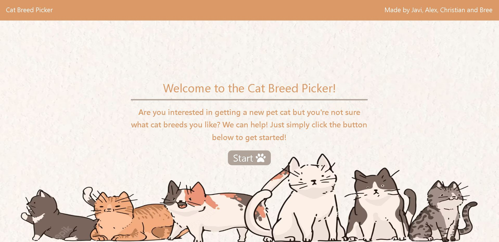
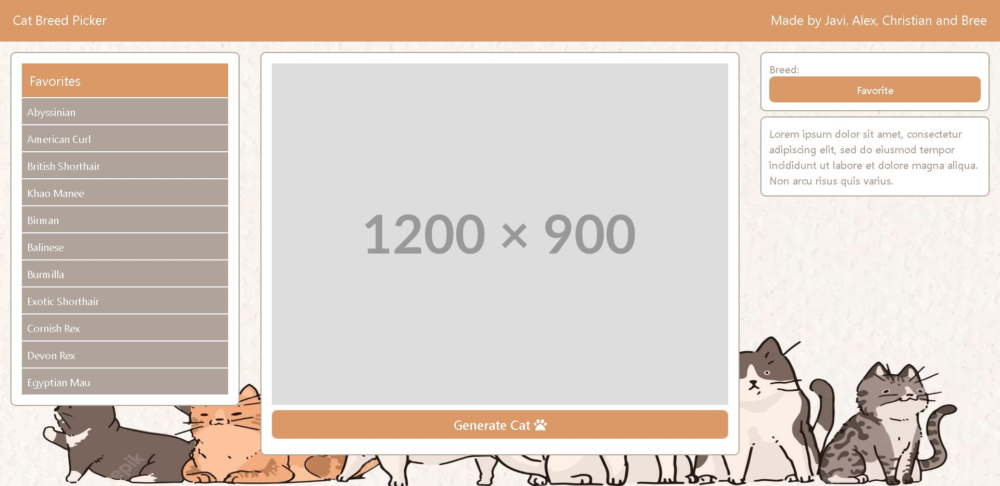

# Cat Breed Picker

## Description

Our project is called "Cat Breed Picker", and we made it to help future cat owners decide what cat breeds they like. We also wanted to make this project to get more practice with CSS frameworks and using third party APIs. While we were making this project, we learned how to style HTML with tailwind CSS, we learned how to use new third-party APIs in order to generate the random cat image and random cat facts.

## Usage

Here is a link to our page: [website link](https://PsychoRSS.github.io/Cat-Picker/)

To use the Cat Breed Picker, press start on the welcome page to begin.

After you press the start button, you will be brought to the main page and you will see three sections. The first section on the left has a "Favorites" list, which will contain the breeds you favorite. The middle section will have a picture of a cat, as well as a "Generate Cat" button on the bottom. You can press this button to generate a new cat picture! The last section on the right contains the current breed, as well as a "favorite" button. When you click this button, it will add the breed to your favorites list on the left. There is also a small section underneath the breed section that contains a random fact about cats!

We hope that using this website will help you select some of your favorite cat breeds!

## Credits

Cat background 
https://www.freepik.com/free-vector/cat-lover-pattern-background-design_15080931.htm

"Font Awesome Introduction" From W3 Schools.
https://www.w3schools.com/icons/fontawesome_icons_intro.asp

"Git merge conflict tutorial" from ihatetomatoes
https://ihatetomatoes.net/git-merge-conflict-tutorial/